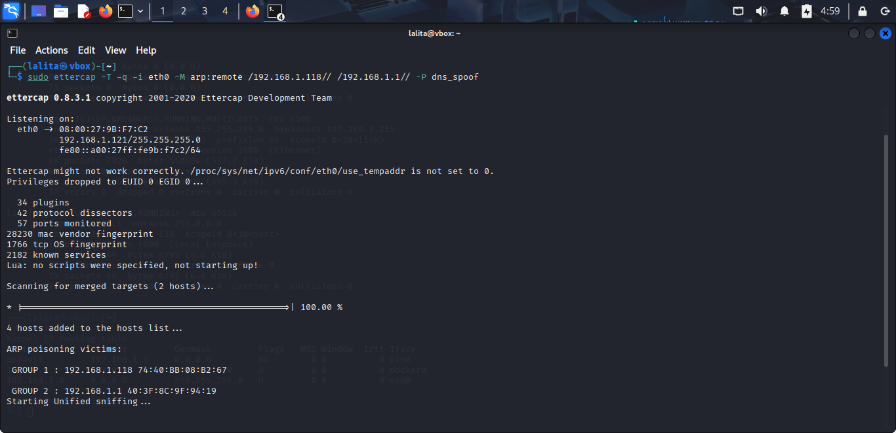
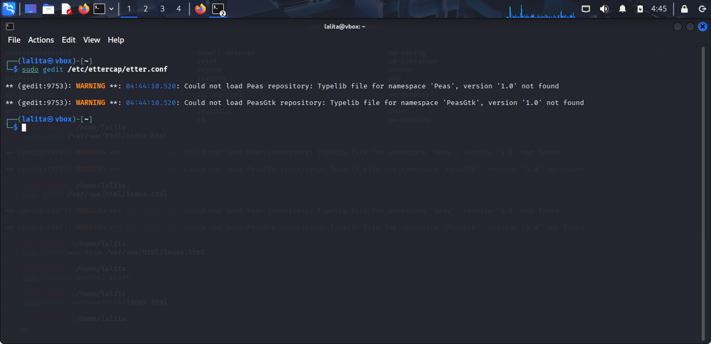
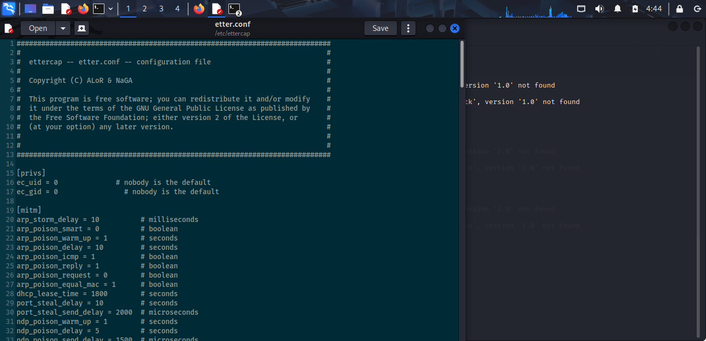
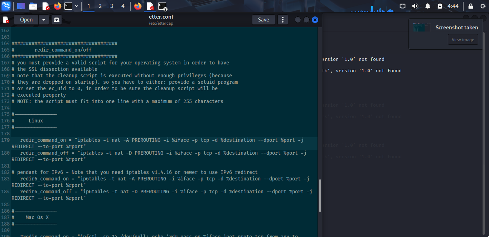
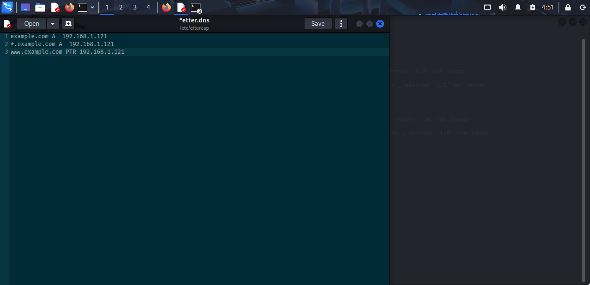
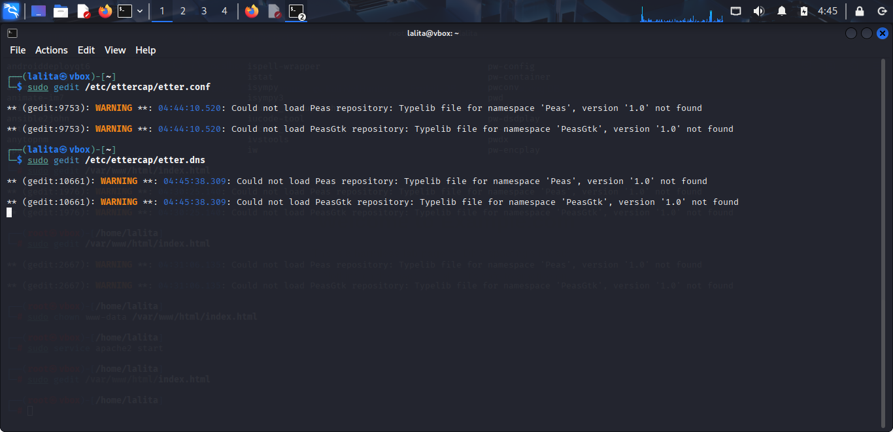
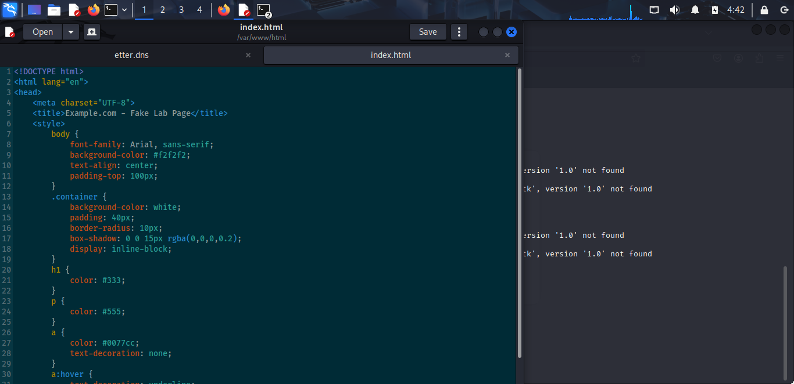
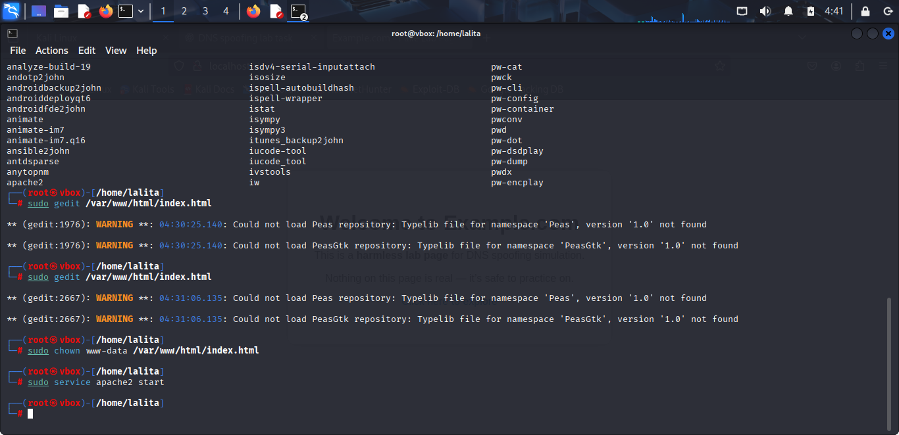

# DNS_SPOOFING_6
# DNS_SPOOFING_6 — Safe Isolated Lab

**Author:** Vaishnavi Nagargoje  
**Date:** 2025-09-20

---

## About
This repository documents a safe, offline DNS spoofing lab performed in a VirtualBox Host-Only network. All experiments were executed on local VMs and did **not** touch the public Internet.

> **Important:** This repository is for educational purposes only. Do not run these techniques on public or production networks.

---

## Lab topology (summary)
- Host-only network: `vboxnet0` (`192.168.56.0/24`)  
- Attacker (Kali): `192.168.56.100`  
- Victim (Windows): `192.168.56.118`  
- Server (Ubuntu/Apache): `192.168.56.102`  
(See the report for a full diagram and exact steps.)

---

## Evidence (screenshots)

### 1) Overall lab screenshot
  
*Figure 1 — Lab overview / high-level screenshot.*

### 2) Ettercap / config edits
  
*Figure 2 — Ettercap configuration edit screen.*

  
*Figure 3 — Changes made to `etter.conf` (sanitized).*

  
*Figure 4 — Another view of `etter.conf` edits.*

### 3) etter.dns / DNS edits
  
*Figure 5 — Edited `etter.dns` file in the lab (sanitized).*

  
*Figure 6 — `etter.dns` entries showing lab-only mappings.*

  
*Figure 7 — Spoofed DNS entry pointing lab domain to attacker's IP (lab-only).*

### 4) Victim browser / fake page
  
*Figure 8 — Victim browser showing the fake lab page (example.lab / example.com simulated locally).*

### 5) Editor / command proof
  
*Figure 9 — Command/editor used to edit lab files.*

---

## Included files & suggested organization
_Current files are currently in repo root. Suggested long-term layout (optional):_

